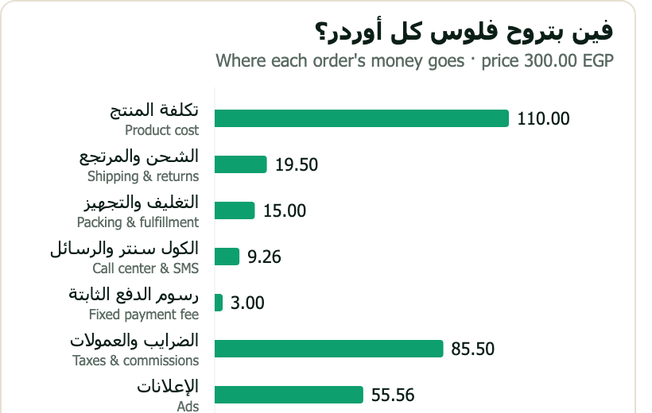
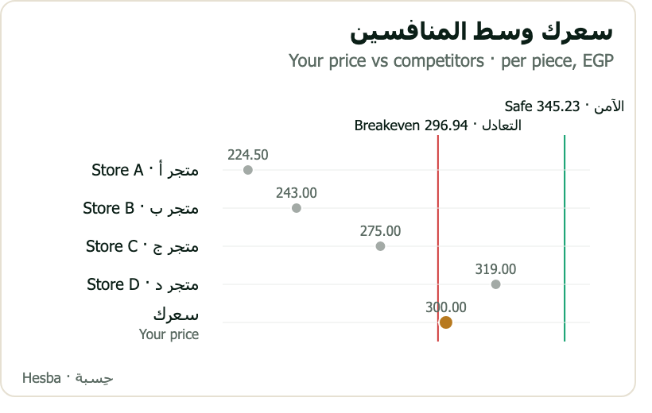

<div align="center">


# Hesba · افندينا

**Know your real profit before the next ad.**

An AI pricing and profit advisor for cash-on-delivery sellers across Egypt, the Gulf and MENA.
Every number comes from a tested calculator — never from the language model.

[Live site](https://hesba-ten.vercel.app) · [Run it in five minutes](#run-it-in-five-minutes) ·
[How it works](#how-it-works)

</div>

---

## The problem

A cash-on-delivery seller pays for the ad up front, but only collects cash if the customer
answers the phone and opens the door. Confirmation rates, delivery rates, returns and courier
fees decide whether an order made money — and none of that is visible in an ads dashboard.

So a campaign showing a healthy ROAS can lose money on every delivered order for weeks before
anyone notices.

## What افندينا does

| | |
|---|---|
| **Price a product** | Safe price, breakeven price, and the profit at the price you charge today |
| **Set the ad ceiling** | The most you can pay per lead and still hit your margin |
| **Check a campaign** | Real orders in, a verdict out: SCALE / FIX / PAUSE, with the one move that matters |
| **Test an offer** | "2 for 550" checked before you launch it |
| **Compare competitors** | Finds offers, asks you to confirm them, then shows where your price stands |
| **Start from zero** | Three questions, then a full price table built on published courier costs |

Every answer carries a chart drawn by the server from its own results, in Arabic and English:

<div align="center">


</div>

## How it works

```
seller ──chat──▶ افندينا on Wesam.ai ──MCP──▶ Hesba calculator ──▶ numbers + signed chart
                 collects inputs,              Deno + TypeScript,
                 explains, never computes      no dependencies, 121 tests
```

The rule the whole project is built on: **the model never does arithmetic.** It gathers inputs,
states its assumptions and explains the verdict; every figure comes from code with a test behind
it. The engine works per *delivered* order, so confirmation and delivery rates, returns, courier
fees, packaging, platform and payment fees, VAT, the courier's cash-collection fee and ad cost
are all counted.

## Run it in five minutes

No account and no API key. Requires [Deno](https://deno.com) 2.x.

```sh
deno task test      # 121 tests: engine parity, the pricing model, validation, MCP protocol, charts
deno task serve     # http://localhost:8000/mcp/dev
```

Call a tool:

```sh
curl -s -X POST http://localhost:8000/mcp/dev -H 'content-type: application/json' -d '{
  "jsonrpc":"2.0","id":1,"method":"tools/call","params":{"name":"price_product","arguments":{
  "productCost":100,"customsDutyPerUnit":10,"leadCpa":15,"confirmationRatePct":60,
  "deliveryRatePct":45,"deliveryFee":25,"returnShippingFee":15,"packagingCost":5,
  "fulfillmentFee":10,"callCenterCostPerLead":2,"smsCostPerLead":0.5,"platformFeePct":8,
  "paymentGatewayPct":2.5,"paymentGatewayFixed":3,"vatPct":15,"marketerCommissionPct":3,
  "targetMarginPct":10,"sellingPrice":300,"lang":"en"}}}'
```

Expected verdict: **BELOW TARGET** — net profit 2.19 EGP per delivered order, suggested price
345.23 EGP.

It also connects to MCP Inspector (`npx @modelcontextprotocol/inspector`) or Claude Code
(`claude mcp add --transport http hesba http://localhost:8000/mcp/dev`).

## The tools

| Tool | What it answers |
|---|---|
| `price_product` | Safe and breakeven price, profit at your price, max CPA, breakeven ROAS, the CR needed, and a verdict |
| `price_scenarios` | Every price worth considering in one table — profit, margin, revenue at a stated ad spend, and a health band |
| `cpa_table` | Max CPA per lead at margins from +20% to −20% |
| `price_bundles` | 2/3/4-piece bundle prices, and checks of offers such as "2 for 550" |
| `check_campaign` | Real campaign P&L and a PAUSE / FIX / SCALE verdict, with orders still in transit excluded |
| `compare_prices` | Your price against confirmed competitor offers: market band, and profit if you matched each one |
| `market_costs` | What couriers actually publish for delivery and returns in a market, with the source link |
| `read_campaign_export` | Turns an ad report you paste (Meta/TikTok/Google, Arabic or English) into per-campaign numbers |

## Layout

| Path | Contents |
|---|---|
| `engine/canonical.ts` | The single pricing model every tool uses |
| `engine/parity.ts` | Faithful port of the original Dart engine, checked against `reference/golden.json` |
| `server/` | MCP Streamable HTTP handler, schemas and validation, text summaries, chart rendering |
| `worker/`, `wrangler.jsonc` | Cloudflare Workers entry point — a second host for the same code |
| `wesam/` | Agent instructions, skills and workflow for the Wesam.ai side |
| `reference/market-defaults.json` | Courier delivery and return costs per market, each with its source page and date |
| `landing/` | Landing page ([hesba-ten.vercel.app](https://hesba-ten.vercel.app)) |
| `specs/` | The contract, the test plan, and design notes for features not yet built |

## Design decisions worth knowing

- **Nothing is estimated.** Where a figure isn't published — confirmation and delivery rates are
  published nowhere in any market researched — the agent asks instead of assuming.
- **Courier costs carry their sources.** Only Egypt, Morocco, the UAE and Saudi Arabia publish
  usable delivery prices; each number links to the page it came from.
- **Charts cannot disagree with the text.** They are rendered server-side from the same result
  object and signed, so a chart link cannot be forged or drift out of date.
- **Orders in transit are not returns.** Counting them as failures turns healthy campaigns into
  "pause" verdicts, so they are excluded from the delivery rate until they settle.

## Production

- Server: `https://hesba-calculator.hesba.deno.net` (Deno Deploy). `/health` and the signed
  chart images at `/chart/...` are public; the MCP endpoint is `/mcp/<token>` and the token is a
  deployment secret, never in this repo.
- `deno task deploy` runs the tests and deploys; `deno task deploy:cf` publishes the same code to
  Cloudflare Workers as a fallback host.

## Status

121 automated tests pass, including parity against the original engine to four decimal places
and independently computed expected values. The server runs in production and is what the agent
on Wesam.ai calls.

Built for the Agents at Work hackathon — Taalam.ai × Wesam.ai × Untap, 2026.
